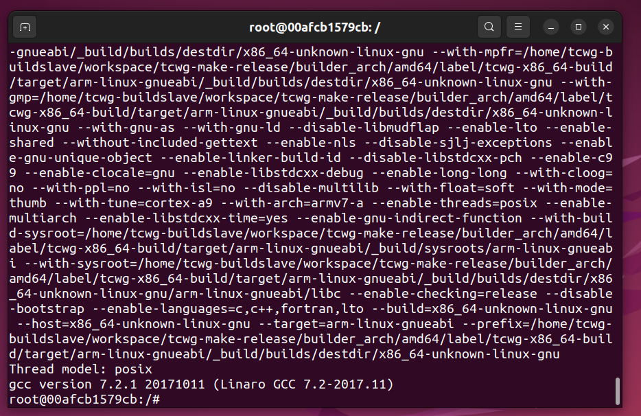

<!--
 * @Author: meteor
 * @Date: 2024-04-28
 * @LastEditTime: 2024-04-28
 * @Description: 
 * 
 * Copyright (c) 2024
-->
# 环境搭建部分

- [2.环境搭建](#head0)
    - [2.1docker环境搭建](#head1)
    - [2.2交叉编译工具准备](#head2)

## <span id="head0">2.环境搭建</span>

本人是在虚拟机下采用docker构建Ubuntu20.04镜像的方式来搭建环境，安装docker的过程参考[docker官网](https://docs.docker.com/engine/install/ubuntu/)，虚拟机主机是Ubuntu22.04(LTS)。

### <span id="head1">2.1docker环境搭建</span>

首先确认docker安装成功`docker --version`，然后pull一下`Ubuntu20.04`的镜像：
```
docker pull ubuntu:20.04
```
*注意：如果没有将docker添加到用户组的话，docker命令前要加sudo，参考[这里](https://docs.docker.com/engine/install/linux-postinstall/)。*

启动Ubuntu容器：
```
docker run -it ubuntu:20.04
```

> 更换容器源为国内源，加快下载速度，这里用的是aliyun：
```
sed -i s@/archive.ubuntu.com/@/mirrors.aliyun.com/@g /etc/apt/sources.list
sed -i s@/security.ubuntu.com/@/mirrors.aliyun.com/@g /etc/apt/sources.list
apt-get clean
```

然后更新容器内的软件包：
```
apt-get update
apt-get upgrade -y
```

安装必要工具：
```
apt-get install git vim wget -y
apt-get install xz-utils nano unzip build-essential bc swig libncurses5-dev libpython3-dev libssl-dev pkg-config zlib1g-dev libusb-dev libusb-1.0-0-dev python3-pip gawk bison flex -y
```

### <span id="head2">2.2交叉编译工具准备</span>

下载交叉编译工具链：
> 我使用的是 **GCC 7.2-2017.11**的版本
```
wget http://releases.linaro.org/components/toolchain/binaries/7.2-2017.11/arm-linux-gnueabi/gcc-linaro-7.2.1-2017.11-x86_64_arm-linux-gnueabi.tar.xz
```
*这里下载速度时慢时快，可以选择从主机复制进docker容器里：`docker cp <host_path> <container_id_or_name>:<container_path>`*

解压到指定目录：
```
mkdir /usr/local/arm
tar -vxf gcc-linaro-7.2.1-2017.11-x86_64_arm-linux-gnueabi.tar.xz -C /usr/local/arm 
```

配置环境变量：
```
vim ~/.bashrc
```

加入编译工具链路径到环境变量中并保存：
```
export PATH=$PATH:/usr/local/arm/gcc-linaro-7.2.1-2017.11-x86_64_arm-linux-gnueabi/bin
```

使能环境变量：
```
source ~/.bashrc 
或 . ~/.bashrc 
```

检查编译环境是否安装成功，有版本号输出且能对应即为成功：
```
arm-linux-gnueabi-gcc -v
```


