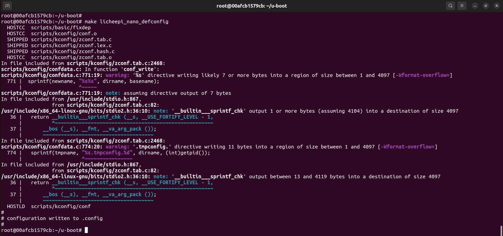
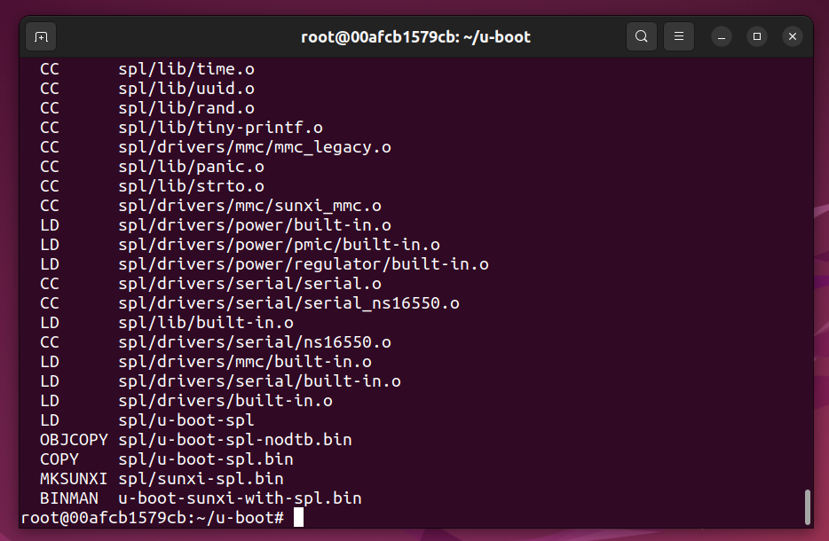
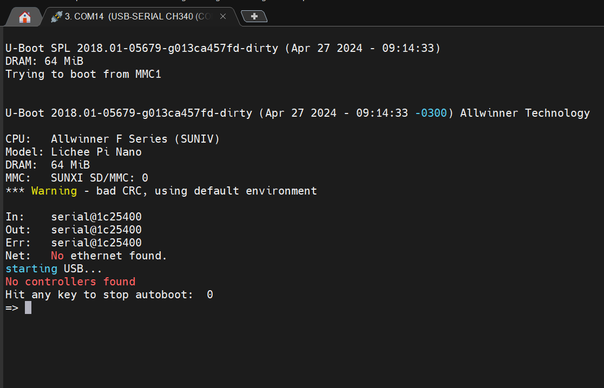

<!--
 * @Author: meteor
 * @Date: 2024-04-28
 * @LastEditTime: 2024-04-28
 * @Description: 
 * 
 * Copyright (c) 2024
-->
# Bootloader部分

- [3.移植U-Boot](#head0)
    - [3.1U-Boot下载](#head1)
    - [3.2U-Boot编译](#head2)
    - [3.3U-Boot烧录](#head3)

## <span id="head0">3.移植U-Boot</span>

### <span id="head1">3.1U-Boot下载</span>

这里主要都是参考别人的做法，需要重点注意的是**FSBL也就是bootROM里面硬写死了会从设备的8K地址处加载SPL，然后进入uboot。因此上面烧写的时候，指定的偏移地址一定是相对于储存设备硬件的偏移，而不是相对于分区的偏移！**

容器内下载u-boot到用户目录：
```
cd ~ && git clone https://github.com/Lichee-Pi/u-boot.git
```

切换到指定分支，使用的是LiChPi-nano的配置：
```
cd u-boot
git checkout nano-v2018.01
```
*可以用`git branch -a`查看所有分支。*

configs文件夹下面有所需的配置文件，查看：
```
cd configs && find -name "*lichee*" && cd ..
```

可以看到有如下的配置文件：
| 文件                    | 用途 |
| ----------------------- | ----------------- |
| licheepi_nano_defconfig | 针对TF卡的配置文件 |
| licheepi_nano_spiflash_defconfig | 针对Flash的配置文件 |

> 因为后面使用的是TF卡作为存储介质，因此只关注licheepi_nano_defconfig

### <span id="head2">3.2U-Boot编译</span>

首先修改u-boot顶层目录下的Makefile：
```
cd ~/u-boot
vim Makefile
```

在约249行左右，可以看到：
```
ifeq ($(HOSTARCH),$(ARCH))
CROSS_COMPILE ?=
endif
```

全部`用#`注释掉，并加入如下代码，用于指定交叉编译器：
```
# ifeq ($(HOSTARCH),$(ARCH))
# CROSS_COMPILE ?=
# endif
ARCH ?= arm
CROSS_COMPILE ?= arm-linux-gnueabi-
```

如果硬件调试串口接的不是uart0而是uart1，参考[这里](https://blog.csdn.net/GJF712/article/details/125175264)进行修改，然后编译配置文件：
```
make licheepi_nano_defconfig
```
如下：




图形界面配置u-boot：
```
make menuconfig
```
> 注意这里在Ubuntu下要将命令行窗口调大，否则会因为显示窗口过小而报错

进入menu后，如果uart用的是uart0的话，则只需配置bootcmd以及bootargs，如果uart用的是uart1则需要配置bootcmd、bootargs以及Device Driver，配置uart1依然参考[这里](https://blog.csdn.net/GJF712/article/details/125175264)（**感谢大佬**）。
> - bootcmd，主要用于描述控制Linux内核文件以及其他描述文件加载到内存中位置以及启动Linux内核系统等
> - bootargs，用于配制文件系统、串口信息等。
> - Device Driver，硬件设备驱动配置。

操作如下：
1. Enable boot arguments 选项上点击空格，弹出Boot arguments选项，输入以下某一内容后保存。
```
console=ttyS0,115200 panic=5 rootwait root=/dev/mmcblk0p2 earlyprintk rw（如果使用串口0）
console=tty1 console=ttyS1,115200 panic=5 rootwait root=/dev/mmcblk0p2 earlyprintk rw（如果使用串口1）
```
2. 同样的操作输入Enable a default value for bootcmd并保存。
```
load mmc 0:1 0x80008000 zImage;load mmc 0:1 0x80c08000 suniv-f1c100s-licheepi-nano.dtb;bootz 0x80008000 - 0x80c08000;
```
*做好上述操作后保存修改并退出menu界面。*

> 因为make过程会用到python2，因此在编译前，需要配置python2环境：
```
apt-get install python2 python2-dev -y
cp /usr/bin/python2 /usr/bin/python
```

最后是编译：
```
make -j4
```
*编译过程有报错问题，可以参考[这里](https://blog.csdn.net/weixin_44220583/article/details/130922292?spm=1001.2014.3001.5502)。等待编译成功后，会在u-boot根目录下看到u-boot-sunxi-with-spl.bin文件，这就是最终要烧录进TF卡的文件。我编译好的文件在[这里](bin/)，该bin文件用的是串口1，有需要自取。*

编译成功：




### <span id="head3">3.3U-Boot烧录</span>

> 注意不能在容器下进行烧录，因为会默认烧到容器下的/dev/sdb中，因此将u-boot-sunxi-with-spl.bin复制到主机用户目录下：
```
docker cp <container_id>:/root/u-boot/u-boot-sunxi-with-spl.bin ~（注意container_id需要换为自己的容器id）
```

最后在主机下插入TF卡，并将bin文件烧录到TF卡的8k偏移地址处；
```
sudo dd if=u-boot-sunxi-with-spl.bin of=/dev/sdb bs=1024 seek=8
```
烧录成功后，先弹出U盘再拔出，然后将TF卡插入卡槽，上电后就可以看到U-Boot输出。此时还没有kernel和rootfs，因此只能进入u-boot的命令模式：


*注意如果没有看到串口输出可以复位一下。*


最后退出docker环境，并保存该镜像，同时清除缓存：
```
exit
docker ps -a
docker commit <container_id_or_name> f1c200s:latest
docker rm <container_id_or_name>
```

