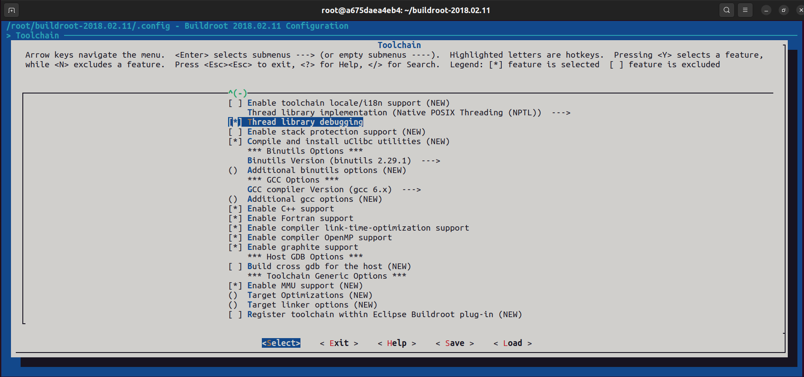
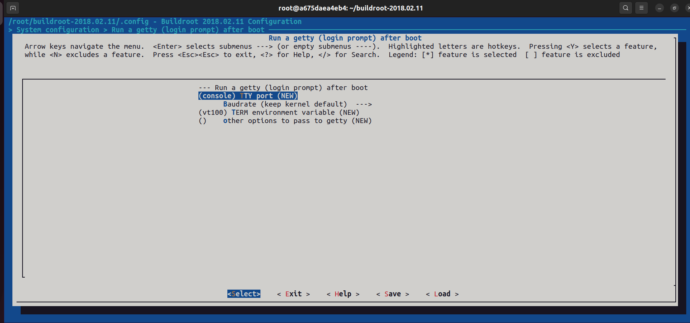

<!--
 * @Author: meteor
 * @Date: 2024-04-28
 * @LastEditTime: 2024-05-03
 * @Description: 
 * 
 * Copyright (c) 2024
-->
# Rootfs部分

- [5.移植根文件系统rootfs](#head0)

## <span id="head0">5.移植根文件系统rootfs</span>

- 首先下载buildroot，这里用的是buildroot2018.2.11版本，进入官网`https://buildroot.org/downloads/`选择.tar.gz文件下载，再放入到docker中；
- 或者选择直接在docker里面使用命令下载：`wget https://buildroot.org/downloads/buildroot-2018.02.11.tar.gz`

下载完成并放进docker的用户目录下，解压该文件：
```
tar -vxf buildroot-2018.02.11.tar.gz
```

进入buildroot根目录，**先清理工程**，再进入图形配置界面：
```
make clean
make menuconfig
```

### 1. 配置Target options：
- Target Architecture：选择ARM (little endian)
- Target Binary Format：选择ELF
- Target Architecture Variant：选择arm926t
- Target ABI：EABI
- Floating point strategy：选择Soft float
- ARM instruction set：选择ARM

*内容如下（转自[这里](https://blog.csdn.net/qq_41709234/article/details/128553772)）：*
- 第一个选项为架构选择，这里选择ARM架构小端模式；
- 第二个为输出的二进制文件格式，这里选择EFL格式；
- 第三个为架构体系，这里选择arm926t，因为F1C200S/F1C100S的架构就是这个架构；
- 第四个为矢量浮点处理器，这里不勾选，因为对于F1C200S/F1C100S而言，其内部没有浮点运算单元，只能进行软浮点运算，也就是模拟浮点预运算；
- 第五个为应用程序二进制接口，这里选择EABI，原因是该格式支持软件浮点和硬件实现浮点功能混用；
- 第六个为浮点运算规则，这里使用软件浮点；
- 第七个选择指令集，这里选择ARM指令集，因为thumb主要针对Cortex M系列而言的，对于运行操作系统的A系列以及ARM9和ARM11而言，使用的都是32位的ARM指令集；


### 2. 配置Build options：

libraries选择both static and shared：


### 3. 配置Toolchain：

使能下列选项：
- Thread library debugging
- Enable C++ support
- Enable Fortran support
- Enable compiler link-time-optimization support
- Enable compiler OpenMP support
- Enable graphite support




### 4. 配置System configuration：

这里设置系统banner（也就是系统启动标语）以及root用户密码，如下：


### 5. 将Debug串口由uart0改为uart1:

进入System configuration下的Run a getty (login prompt) after boot选项，在(console) TTY port出填写console，如果此处已经填写console，则无需修改：




### 6. 编译以及移植

使用`make -j4`进行编译：
- 可能会报错库未安装，先`apt-get update`更新包，再`apt-get install`安装对应的库即可
- 编译报错：
```
checking whether mknod can create fifo without root privileges... configure: error: in `/root/buildroot-2018.02.11/output/build/host-tar-1.29':configure: error: you should not run configure as root (set FORCE_UNSAFE_CONFIGURE=1 in environment to bypass this check)
```

> 这是因为在`/root/buildroot-2018.02.11/output/build/host-tar-1.29`目录中运行configure时使用了root权限，而通常情况下不建议以root身份运行configure脚本，因为这可能会导致意外的权限问题或者不安全的配置。解决这个问题的方法是设置环境变量FORCE_UNSAFE_CONFIGURE=1，以绕过这个检查。

**在`~/.bashrc`下加入环境变量：**
```
vim ~/.bashrc
输入：export FORCE_UNSAFE_CONFIGURE=1，保存退出
. ~/.bashrc
```
*再进行编译：*


> **编译过程非常慢...**，我用的是4G内存，4核的Ubuntu22.04 LTS进行编译，大概用了3个半小时。

编译完成后，在buildroot根目录的`output/images`目录下生成一个`rootfs.rar`文件，这个就是编译后的根文件系统，我的文件在[这里](bin/)，有需要自取。


>将其从docker复制到主机中：`docker cp <container_id>:/root/buildroot/output/images/rootfs.rar ~`

然后在主机下插入U盘，将该文件系统解压到rootfs分区即可：
```
cd ~
sudo tar -vxf rootfs.tar -C /media/meteor/rootfs/
```

解压后，先弹出U盘再拔出，然后将TF卡插入卡槽，上电后就可以看到U-Boot、Kernel、Rootfs一起工作了，移植过程算是小小地成功了~


*注意如果没有看到串口输出可以复位一下。*


---
最后退出docker环境，并保存该镜像，同时清除缓存：
```
exit
docker ps -a
docker commit <container_id_or_name> f1c200s:latest
docker rm <container_id_or_name>
```
