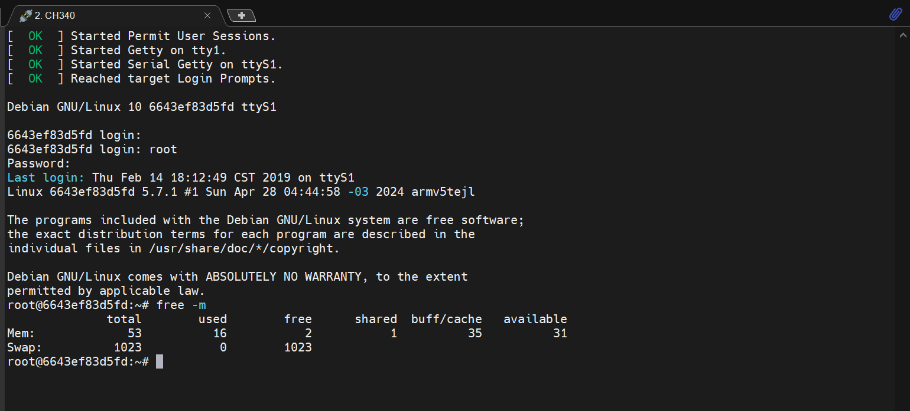

<!--
 * @Author: meteor
 * @Date: 2024-05-28
 * @LastEditTime: 2024-05-28
 * @Description: 
 * 
 * Copyright (c) 2024
-->
# Debian部分

- [6.移植Debian系统](#head0)
    - [6.1 前置配置](#head1)
    - [6.2 环境配置](#head2)
    - [6.3 上机配置](#head3)

## <span id="head0">6.移植Debian系统</span>


### <span id="head1">6.1 前置配置</span>

首先运行docker，并将~挂载进容器里，方便数据交换。

- *切记运行docker时要加--privileged参数使能特权模式，否则后续mount设备时会报错Permission Denied！*

```
docker run -it --privileged -v ~:/workspace f1c200s:latest
```

进入容器后更新包数据：
```
apt update && apt upgrade -y
```

然后安装**qemu**(arm模拟器)以及**bootstrap**(用于构建文件系统)：
```
apt install qemu-user-static debootstrap -y
```

在~(也就是/root)下新建文件夹，用于存放后续的rootfs：
```
cd ~ && mkdir debian-rootfs && cd debian-rootfs
```

*安装debian archive的签名：*
```
apt-get update
apt-get install debian-archive-keyring -y
```

然后下载debian的armel版本，即软浮点(另外armhf为硬浮点)

- **注意在huaweicloud以及aliyun下的armel都没了，只在官网存档处看到有。网址是：http://archive.debian.org/debian/dists/buster/main/binary-armel 。**
```
debootstrap --foreign --verbose --arch=armel buster rootfs http://archive.debian.org/debian/ 
```
*注意这里是archive，所以下载很慢*

下载完成之后，挂载dev到armel下，用于后续的模拟器运行：
```
cd rootfs
mount --bind /dev dev/
mount --bind /sys sys/
mount --bind /proc proc/
mount --bind /dev/pts dev/pts/
```

将qemu模拟器复制到usr/bin/，便于后续使用：
```
cp /usr/bin/qemu-arm-static  usr/bin/
```

>接下来需要改变根文件目录。**(在Linux系统中，系统默认的目录结构都是以 /，即以root开始的。而在使用chroot之后，系统的目录结构将以指定的位置作为 / 位置。)**

设置环境变量，将rootfs切换为新的根目录，并执行/debootstrap/debootstrap(此时的/就已改为了rootfs)。*命令中的--second-stage 选项表示执行debootstrap工具的第二阶段操作，该阶段通常用于完成基本的系统初始化。*

在此之前，需要让容器中的程序以不同的格式执行，否则下个命令报错：
```
update-binfmts --enable && cd ..
```

再使用debootstrap进行配置：
```
LC_ALL=C LANGUAGE=C LANG=C chroot rootfs /debootstrap/debootstrap --second-stage --verbose
```

接下来进入qemu虚拟器：
```
LC_ALL=C LANGUAGE=C LANG=C chroot rootfs
```
*在qemu虚拟器中可能无法使用上下键，输入bash回车后即可。*

### <span id="head2">6.2 环境配置</span>

接下来安装一些需要使用到的包：
>先装vim，再安装包，这里吐槽一下vi不好用hhh
```
apt-get install vim -y && apt-get update
```

安装httsp源配置包：
```
apt install apt-transport-https ca-certificates -y
```

安装网络相关库：
```
apt-get install wpasupplicant net-tools udhcpc -y
```

安装一些测试库(触摸屏、音频测试)：
```
apt-get install evtest mplayer alsa-utils -y
```

安装其他组件：
```
apt-get install wireless-tools sudo openssh-server htop -y
apt install pciutils usbutils wget curl -y
```
>acpi无法安装成功，换了其他的源也不可以

---
然后配置root密码：
passwd root

添加用户meteor，**(可选，但是不知道为什么使用用户登录之后不能使用poweroff等基本命令，留坑)**，并配置用户密码：
```
echo 'meteor:x:1000:1000::/home/meteor:/bin/bash' >> /etc/passwd
passwd meteor
```

配置时区：
```
cp /usr/share/zoneinfo/Asia/Shanghai /etc/localtime
```

配置SSH：
```
vim /etc/ssh/sshd_config
```
>写入：PermitRootLogin yes

打包rootfs：
```
apt clean                           #清理
exit	                            #退出bash
exit	                            #退出chroot
rm rootfs/usr/bin/qemu-arm-static   #删除之前拷贝的文件
cd rootfs
umount   dev/pts/                   # 一定要在/dev之前umount
umount   dev/
umount   sys/
umount   proc/
```

tar存档(也可以不存档，直接复制整个文件夹到tf卡指定分区即可)：
```
cd rootfs/ && sudo tar cvf ../rootfs.tar ./ && cd ..
```

在docker内将rootfs复制到先前挂载的~中，这会自动同步到docker外；
```
cp rootfs.tar /workspace/f1c200s-bin/debian-fs
```

---
最后退出docker环境，并保存该镜像，同时清除缓存：
```
exit
docker ps -a
docker commit <container_id_or_name> f1c200s:latest
docker rm <container_id_or_name>
```
---

解压rootfs到tf卡的rootfs分区：
```
sudo tar -vxf ./rootfs.tar -C /media/meteor/rootfs/
```

将tf卡unmount后再eject，插入板子中并上电，可以看到已经成功移植了Debian系统


### <span id="head3">6.3 上机配置</span>

*使用root登录，密码为之前所设置的密码。下面**在f1c200s下**增加swap分区(可以理解为虚拟内存，以下操作都是在f1c200s下进行)：*

首先查看系统当前内存情况：
```
free -m
```

创建swap分区大小：
```
dd if=/dev/zero of=/swap1 bs=1M count=1024
```
>bs如果不写单位就是字节，count是SWAP大小，1024就是1GB

接下来设置swap分区为0600权限，保证/swap1这个文件只允许所有者对其进行读取和写入操作，而其他用户没有任何权限。
```
chmod 0600 /swap1
mkswap /swap1
```

激活swap分区：
```
swapon /swap1
```
**再查看当前内存情况，可以看到Swap已经增加了指定大小**


配置fstab，使能开机自动激活swap：
```
vim /etc/fstab
```
>最后一行添加：/swap1 swap swap defaults 0 0

重启测试：
```
reboot
free -m
```



**可以发现已经配置成功了**
>完~          虽然有些坑，但还是感谢大佬的[文章](https://blog.csdn.net/qq_41709234/article/details/128570505)。

