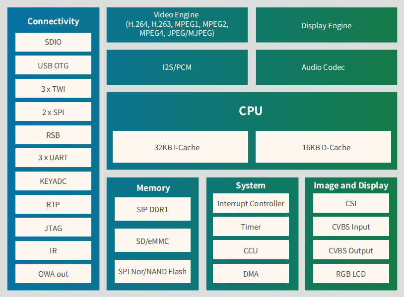
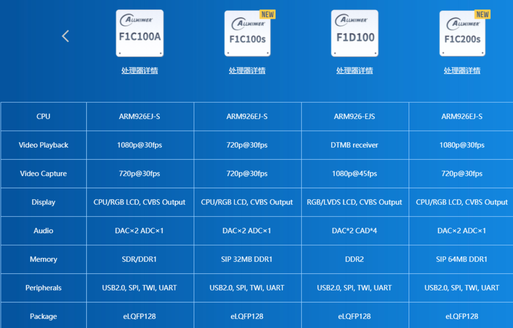

<!--
 * @Author: meteor
 * @Date: 2024-04-27
 * @LastEditTime: 2024-05-28
 * @Description: 
 * 
 * Copyright (c) 2024
-->
# Mestr

**NES游戏机项目**
---

- [0.说明](#header0)
- [1.硬件设计](1.Hardware/README.md)
- [2.环境搭建](2.Env/README.md)
- [3.移植U-Boot](3.Bootloader/README.md)
- [4.移植Linux内核](4.Kernel/README.md)
- [5.移植根文件系统rootfs](5.Rootfs/README.md)
- [6.移植Debain系统](6.Debian/README.md)
- [7.应用开发]()
- [8.总结]()

## 0.说明

> 这是一个基于全志F1C200s芯片的NES游戏机，由于其具有SiP的64MB DDR(不用画高速电路...)，且价格低廉，资料较丰富，对于我这种新手来说无疑是很好的选择，于是就有了这个repo...

**板载资源**

**同系列芯片性能对比，可以看到F1C200s是非常优秀的，且在某宝上仅售15RMB**

~~以下是成品图~~

## Acknowledgement

> 学习过程主要参考了下面这些大佬的文章，肥肠感谢：
- [某宝LCPI参考手册](http://wiki.lcmaker.com/index.php?title=LC-PI-200S#.E5.8A.9F.E8.83.BD)
- [稚晖君的Plank-Pi](https://github.com/peng-zhihui/Planck-Pi)
- [Kashine的从零开始自制linux掌上电脑](https://blog.csdn.net/qq_41709234/article/details/128825217)
- [江麟的f1c200s---编译uboot](https://blog.csdn.net/weixin_44220583/article/details/130922292?spm=1001.2014.3001.5502)
